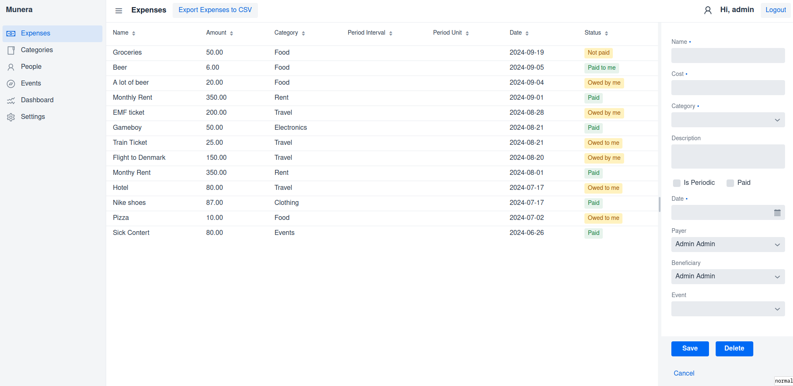

# Munera: Expense Tracking Application

## Overview

Munera is a companion for managing expenses efficiently and effortlessly, whether you're tracking daily expenditures, managing recurring expenses, or keeping tabs on creditors and debtors.
Dashboard:

Expenses grid:

People grid:

### 1. Expense Management

- Create, read, update, and delete expenses with the following details:
    - Name
    - Date
    - Category
    - Cost
    - Description
    - Period Interval (1, 2, 3, etc)
    - Period Unit (days, weeks, months)
    - Creditors and debtors
    - Status
    - 
- Create, read, update and delete categories
- Create, read, update and delete people
- Create, read, update and delete events

- Graphs are now available!

## Completed Features
- [x] Create categories with CRUD operations
- [x] Create concept of creditors and debtors for each expense
- [x] Insert expenses of the past and of the future
- [x] Have an option to set up recurring expenses
- [x] Creditors and debtors total expenses 
- [x] Setup status for each expense
- [x] Create mechanism to change status when expense gets paid
- [x] Create labels to show if a person is in debit or credit with you
- [x] First tries with widgets in a dashboard view
- [x] An expense cant have the same person as both creditor and debtors
## Next Steps

1. **Filtering and Sorting**
    - Keep implementing sorting on more columns, start implementing filtering
    - Specification
   
2. **Weekly and Monthly Summaries**
    - Create functionality to generate weekly and monthly summaries, including filtering and sorting options.
    - ~~Create a dashboard or log of "next expenses" that lists the next recurring expenses that you expect to receive~~

3. **Reports for Creditors and Debtors**
    - ~~Develop reports outlining debts or credits for each creditor and debtor to provide users with a comprehensive overview.~~
    - ~~CRUD operations for creditors and debtors~~

4. **Create a way to set the currency of each expense**
    - It should be possible in the form of an expense
    - The symbol should be added to the cost column
    - If possible, the calculations should take into account the different currencies

5. **Events**
    - ~~Options to create events in which to put expenses (vacations, congress, etc.)~~
    - ~~Each event has a number of people connected to it, expenses can be added to these people~~
    - A reports tells which people need to give/take money to which people in order to be even

6. **Misc**
    - PeriodUnit and Interval need to be implemented with a scheduler
    - Graphs could use more work, maybe some filtering?
    - More validation in form
    - ~~Login page~~
    - email setup
    - Migration tool for DB changes in prod

7. **Deployment**
    - Improve the Dockerfile and docker-compose.yml
    - Improve the deploy.yml
    - Fix known bugs in the pipeline

## Known Issues

- PeopleVIew doesn't refresh after an edit operation anymore
- Form still needs more validation when empty, some entities can be created with all null values, even the ones that have constraints throw SQL errors, they need to be gracefully handled.
- Errors need to be caught and handled
- Graphs still need ~~a lot of~~ **some** improvements
- ~~ExpenseView doesn't refresh after an edit operation anymore~~
- Deployment must be improved
