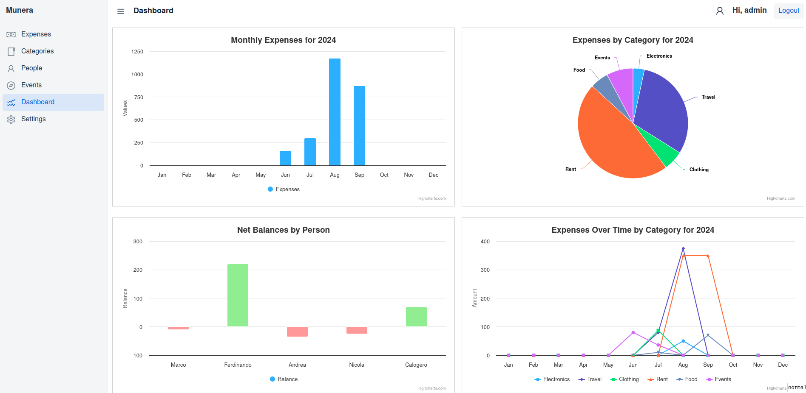

# Munera: Expense Tracking Application

## Overview

**Munera** is your go-to companion for managing expenses efficiently and effortlessly, whether you're tracking daily expenditures, managing recurring expenses, or keeping tabs on creditors and debtors.

Munera is built using **Java** with the **Spring** framework. It utilizes **Vaadin Flow** for creating modern web applications. The application uses a **PostgreSQL** database for data storage. **Maven** is employed as the build tool, while **JUnit** and **Mockito** are used for unit testing. **Spring Security** handles authentication, and **Apache Commons** to export data.

### Dashboard



### Expenses Grid


### People Grid


## Features

### 1. Expense Management

Easily create, read, update, and delete expenses with comprehensive details, including:

- **Name**: The name of the expense.
- **Date**: The date the expense occurred.
- **Category**: Assign categories to expenses for easier tracking.
- **Cost**: The amount spent.
- **Description**: Additional notes or details about the expense.
- **Period Interval**: Set the recurrence interval (e.g., 1, 2, 3, etc.).
- **Period Unit**: Specify the unit for the period interval (days, weeks, months).
- **Payer and Beneficiary**: Record who paid and who benefited from the expense.
- **Date of Payment**: The date when the payment was made.
- **Status of Expense**: Track the status of the expense (e.g., "Paid to Me", "Owed to Me", "Paid by Me", "Owed by Me").

### 2. Category Management

- Manage categories for better organization of expenses.
- Default categories are initialized on the first build of the application.

### 3. People Management

- Track expenses related to people and generate reports on amounts owed or owing.

### 4. Reporting and Analysis

- Generate reports to view expenses and debts by category or person.
- Visualize your expenses with built-in graphs.

### 5. Data Export

- Export your expense data to CSV format for external use and backup.

### 6. Upcoming Features

- **Income Tracking**: An upcoming feature to manage and track income efficiently.

## Installation

You can self-host Munera in two ways:

### Option 1: Manual Installation

1. **Compile and Run**: Download the source code, compile, and run the application manually with your preferred SQL database.
2. **Default Setup**: The first build will automatically create default categories and an admin user, as specified in the `application.properties` file.

### Option 2: Docker Installation

1. **Dockerized Setup**: Use the provided `Dockerfile` and `docker-compose.yml` files to deploy Munera using Docker.
2. **Configuration**: The first build will set up default categories and an admin user based on the environment variables in `docker-compose.yml`.

## Getting Started

Follow the steps below to get started with Munera:

1. **Clone the Repository**:
    ```bash
    git clone https://github.com/yourusername/munera.git
    cd munera
    ```

2. **Manual Installation**:

    - Configure your SQL database.
    - Adjust settings in `application.properties`.
   - Build and run the application with Maven:
     ```bash
     mvn clean install
     mvn spring-boot:run
     ```

3. **Docker Installation**:

    - Ensure Docker is installed and running.
    - Use Docker Compose to set up Munera:
      ```bash
      docker-compose up --build
      ```
      
## License

Munera is licensed under the **GNU Affero General Public License** (AGPL) Version 3. See the LICENSE file for details.

## Feedback and Contributions

Contributions and feedback are welcome! Feel free to submit a pull request or open an issue on the [GitHub repository](https://github.com/filippo-ferrari/munera).